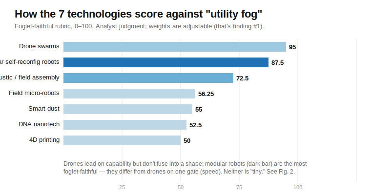
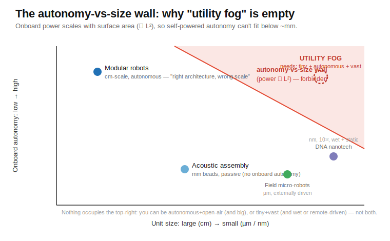
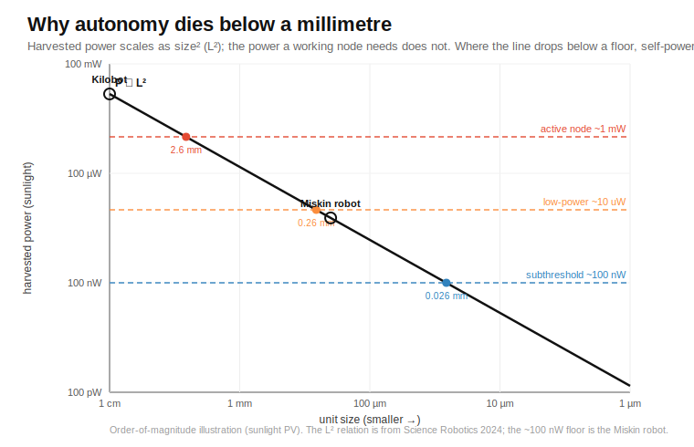

# Programmable Matter Is Already Here — and It's Astonishing

### Trillion-piece nanomachines, robot swarms that assemble themselves, objects built in mid-air by sound. The sci-fi dream of "matter you can program" quietly became real. Here's the tour — and the one beautiful frontier left.

---

Somewhere in a lab right now, a **trillion** microscopic machines are folding themselves into a precise shape — in a single test tube, in a single afternoon. Down the hall, a thousand coin-sized robots crawl across a table and, with no one steering them, arrange themselves into a five-pointed star. In another building, a floating bead dances through the air fast enough to paint a glowing 3D image you can walk around — held up by nothing but sound.

None of that is a rendering. None of it is "10 years away." It's **programmable matter**, and it already works.

We were promised, decades ago, a world of *utility fog* — clouds of tiny robots that snap together on command into a chair, a wall, a tool, then melt back into a shimmer. We tend to say that future never arrived. But that's the wrong way to look at it. **It arrived in pieces — and each piece is a genuine marvel.** This is the story of what actually works, told in plain language first, then with the real numbers for the curious. And it ends somewhere hopeful: with the single, well-defined frontier that stands between the pieces we have and the dream we were sold.

---

## The big picture, in plain English

"Programmable matter" means exactly what it sounds like: **stuff whose shape or behavior you can command.** Not a machine that *makes* a shape — the material itself *is* the shape, and it can become another one.

Nature already does this. A ribosome reads instructions and builds a protein. A murmuration of starlings becomes a swirling sheet, then a funnel, then a sphere, with no leader. The dream is to *engineer* it: to get raw stuff to organize itself into whatever we ask for.

Here's the delightful part — **we've cracked it, six different ways.** Each way is a superpower, and each one is real today:

- **We can build with atoms as if they were LEGO.** Using DNA as a construction material, scientists fold *nanometer-scale* objects with breathtaking precision, by the *trillion* at a time.
- **We can make robot swarms that assemble themselves.** A thousand simple robots, each cheap as a sandwich, cooperate using only whispers to their neighbors — and a shape emerges.
- **We can build things in mid-air with sound.** Focused ultrasound levitates and arranges objects with no container and no contact.
- **We can print objects that transform themselves after they're made.** "4D printing" makes flat sheets fold into structures, and materials that change shape with heat or light.
- **We can pattern thousands of living cells into a shape in seconds** — and freeze them into real tissue. Acoustic bioprinting is a genuine manufacturing tool.
- **We can fly coordinated swarms** of hundreds of units that morph their formation on command.

Six superpowers. Every one of them would have looked like magic in 1990. The honest, cheerful truth is that **the field didn't fail — it fragmented into a half-dozen spectacular successes**, each brilliant at a *different* part of the dream.

So which one is "the future of programmable matter"? That turns out to be the wrong question — and realizing *why* it's the wrong question is the first of two genuinely fun discoveries.

---

## Scoring the dream (here come the technicals)

To compare six very different technologies fairly, you need a yardstick. So I wrote one: eight things the classic *utility fog* vision demands, weighted by how central each is.

- **Reversible reconfiguration on command** *(weight: 20)* — can it change shape when you ask?
- **Works in open air** *(20)* — in a room, not sealed in liquid
- **Discrete, addressable units** *(15)* — many little pieces, not one blob
- **Speed of movement/change** *(15)* — does it act fast?
- **Onboard autonomy — own power + brain** *(10)* — does each piece run itself?
- **Scales to vast numbers** *(10)* — thousands? trillions?
- **Reusable over many cycles** *(5)* — does it last?
- **Manufacturable at scale** *(5)* — can we actually make a lot?

*(The two big gates — "changes shape on command" and "works in open air" — are worth 20 points each; the whole thing sums to 100.)*

Score each technology *demonstrated / partial / absent*, add it up, and you get a scoreboard. **A crucial caveat that turns out to be a highlight, not a footnote:** these scores are judgments, and the *weights are a choice*. Change what you care about and the ranking changes — which is exactly the first discovery.

*Figure 1. The scoreboard. Every one of these is a real, working technology — the differences are about which part of the dream each one nails.*

1. **Drone swarms — 95.** Coordination and capability, today.
2. **Modular self-reconfiguring robots — 87.5.** Genuinely reshape themselves, autonomously.
3. **Acoustic / field assembly — 72.5.** Builds in open air, fast and cheap.
4. **Field micro-robots — 56.25.** The fastest reconfiguration at micro-scale.
5. **Smart dust — 55.** Sensing at the millimeter scale.
6. **DNA nanotech — 52.5.** Atomic precision, trillion-count.
7. **4D printing — 50.** Real solids that self-morph.

Look at the top of that board and celebrate for a second: **the closest thing to a real foglet is a swarm of robots that physically dock together and rearrange themselves** — and it *works today* (Harvard's Kilobot put 1,024 of them on a table for ~$14 each). That's not a consolation prize. That's a robot swarm compiling a human-drawn shape from nothing but local rules. Thirty years ago that was pure fiction.

---

## Discovery #1: everyone wins — you just pick your superpower

The ranking flips depending on what you actually want.

Care about *building medicine at molecular scale*? **DNA nanotech rockets to #1** — nothing else touches its trillion-count precision, and DNA-origami cancer-vaccine scaffolds are on a clinical-development track. Care about *coordinated units in the field this year*? Drones win outright. Care about *fast micro-scale shape-shifting in fluid*? The micro-robots lead.

> There's no single "best" programmable matter — there's a best tool *for each job*, and we already have all of them.

That's a genuinely optimistic result. It means the toolbox is full. The engineer's job isn't to wait for one miracle material; it's to **match the superpower to the mission** — and every mission on that list already has a winner.

---

## Discovery #2: the one grand frontier (and exactly what unlocks it)

So what *would* it take to build the original dream — fog that's tiny *and* vast *and* self-directing, all at once?

Here's the elegant part. When you plot every technology by two axes — how *small* each unit is, and how much *autonomy* (its own power and brain) each unit carries — a clear picture appears.

*Figure 2. Map every technology by size and onboard autonomy, and one corner — tiny **and** self-powered — is the open frontier. It has a name and a cause, which is exactly why it's a solvable target.*

The reason that corner is still open is beautifully simple physics: **a device powers itself from its surface, and surface area shrinks as the square of size (∝ L²).** So the smaller a unit gets, the less room it has to carry its own battery and brain. Above about a millimeter, a robot can be fully autonomous (that's the Kilobot). Below it, today's tiny machines borrow their power and steering from outside — magnetic or acoustic fields — which is *why microscopic swarms are so nimble in the first place.*

Read that again, because it's the good news hiding inside the "hard" news: **the frontier isn't vague. It's a single, named, physical target.** "Get real autonomy below a millimeter." And there are already credible attack routes on it:

- **Harvest power instead of storing it** — microscopic robots the size of a grain of salt already run on light-harvested electricity (~100 nanowatts) with real logic onboard (Cornell/Michigan). Push that further and the L² wall moves.
- **Beam power in** — treat "external field control" not as cheating but as *wireless power*, and the autonomy line blurs.
- **Let the units be dumber but the swarm smarter** — modern swarm algorithms compile global shapes from trivially simple parts. Maybe individual genius isn't required.

None of these is science fiction; each is an active research program. The utility-fog dream isn't *disproven* — it's been **localized to one crisp engineering question with several live answers.** That's the most exciting place a field can be.

---

## The takeaway

Programmable matter is one of those quiet revolutions that happened while we weren't looking. We can build with DNA by the trillion. We can make robots that assemble themselves. We can sculpt objects out of thin air with sound, and print things that reshape themselves after they're printed. **Every one of those is a working superpower, and together they cover almost the entire original dream.**

The last piece — tiny, autonomous, and everywhere at once — waits behind a single, well-understood wall. And walls with names and causes are the kind engineers knock down. If I had to bet on where the next jaw-dropping headline in this field comes from, it's from someone who figures out how to give a speck of dust its own power and its own mind.

When they do, the fog rolls in.

---

# Part II — The Technical Deep-Dive

*Everything above is the story. Everything below is the engineering underneath it — how each technology actually works, the real numbers, and where the physics bites. If you're here for depth, this is the part for you.*

## A. How the scoring actually works

The scoreboard isn't a vibe; it's arithmetic. Each of the eight gates gets a status — **demonstrated = 1.0, partial = 0.5, unknown = 0.25, absent = 0.0** — multiplied by its weight, and summed to 100.

Take DNA nanotech as a worked example. It scores *absent (0.0)* on open-air operation (it needs a wet buffer — more on why below), *partial (0.5)* on reversible reconfiguration (most DNA devices are two-state switches, not freely reshapeable), *demonstrated (1.0)* on discrete units and on scale (it makes 10¹² addressable objects per batch), *partial (0.5)* on speed and autonomy, and *partial-to-demonstrated* on lifetime and manufacturability. Weight those and you land at **52.5**.

Now the important part — the **sensitivity analysis**, which is discovery #1 made quantitative. The ranking is a dot product of a *capability vector* (what each technology can do) and a *weight vector* (what you care about). Change the weight vector and the winner changes. Down-weight "open air" and "vast numbers," up-weight "molecular precision" and "manufacturability at scale," and DNA's two weakest gates stop mattering while its two strongest dominate — it vaults to #1. That's not the rubric breaking; that's the rubric correctly reporting that *"best" is a function of the goal.* The honest output of this whole exercise isn't a number — it's a **method for matching a technology to a mission.**

## B. Building with DNA: origami, scaffolds, and the buffer that traps it

DNA "nanotech" doesn't use DNA for genetics — it uses it as a **programmable construction adhesive.** The trick is Watson-Crick base pairing: A binds T, C binds G, always. So a strand's sequence is an address, and two strands with complementary sequences will find each other and stick.

**Scaffolded DNA origami** (Paul Rothemund, 2006) is the workhorse. You take one long "scaffold" strand — canonically the ~**7,249-nucleotide** genome of the M13 bacteriophage virus — and ~200 short "staple" strands. Each staple is designed to grab two or three specific, distant points on the scaffold and pull them together. Dump them in a tube, heat, cool, and the scaffold folds itself into whatever shape you drew, held by the staples. It's self-assembly with a blueprint.

The blueprint is drawn in CAD tools: **caDNAno** (Douglas, 2009) for manual layouts, and automated scaffold-routers like **DAEDALUS/ATHENA** that take an arbitrary 3D mesh and compute the staple set for you. Scale-up is hierarchical: **gigadalton assemblies** (Wagenbauer & Dietz, *Nature* 2017) build origami "bricks," then assemble the bricks into objects of **1.2 billion daltons, ~450 nanometers** across; DNA "crisscross slats" (2023) reach several microns.

Here's the elegant, *fundamental* reason DNA scores zero on "open air": the DNA backbone is a chain of **negatively charged phosphates.** Two strands trying to pack next to each other repel. To beat that repulsion, origami is folded in a buffer with **~10–20 millimolar magnesium (Mg²⁺)** — the positive ions screen the charge and let the structure condense. Take away the water and salt, and electrostatics blows the structure apart. This is *physico-chemistry, not a manufacturing cost you can engineer away* — which is exactly why the "every barrier is just an engineering knob" story doesn't survive contact with DNA.

DNA's other soft spots are speed and reconfiguration. Shape *changes* happen by "toehold-mediated strand displacement" — one strand peels another off — which is reliable but **slow (seconds to minutes)**. Add external magnetic handles and you can clock a DNA robot arm at a few hertz (Kopperger, 2018); spring-loaded "SEPP" arrays (*Science Robotics*, 2025) finally give genuine multi-state reconfiguration. And where DNA is untouchable is **scale and translation**: 10¹² identical nanostructures per milliliter, gram-scale bioproduction, and a real clinical trajectory — CpG-adjuvant origami cancer vaccines (DoriVac) and PEGylated-oligolysine coatings that give roughly **1,000× protection** against blood nucleases.

## C. Modular robots: momentum, magnets, and an NP-complete traffic problem

If DNA is the master of *small and many*, modular robots are the masters of *autonomous and reconfiguring* — each unit is a complete little computer that carries its own power and brain.

**Kilobot** (Rubenstein & Nagpal, *Science* 2014) is the scale champion. Each 3.3-cm robot stands on three rigid legs and moves by **slip-stick vibration** — two off-center pancake motors buzz it forward at ~**1 cm/s**, turning at ~45°/s. It has an onboard microcontroller, a Li-ion cell (3–12 h), and an infrared transceiver that talks *only to neighbors* by bouncing IR off the table (**~10 cm range, 30 kb/s**). No robot can see the whole picture. The magic is three local rules run identically on all 1,024 units: **edge-following** (crawl along the group's boundary), **gradient formation** (a number that increments as it hops robot-to-robot, giving each unit its distance from a seed), and **localization** (trilaterate your own coordinates from measured neighbor distances). A few hand-placed seed robots define the origin. From that, a human-drawn 2D shape crystallizes out of the swarm — in about **12 hours**, for **~$14 a robot**. The honest limits are in the paper: units drift off straight lines, distance sensing varies unit-to-unit, and traffic jams are constant. It's planar, slow, and imprecise — *and it is still one of the most remarkable demonstrations in robotics.*

**M-Blocks** (Romanishin & Rus, MIT) go 3D. Each 50-mm, 143-g cube hides a **flywheel spun to 20,000 RPM**; slam on the brake and the dumped angular momentum (~1.6 N·m, in ~15 ms) flips the cube through the air — a ballistic "jump." Cylindrical magnets on all twelve edges let cubes snap together and pivot around each other. M-Blocks 2.0 (2019) coordinated **16** cubes with barcode-like face IDs; the 3D version torques about three axes to climb cubic lattices.

But here's the wall for the *whole family*: the largest **reliable physical 3D self-reconfiguration ever demonstrated** is **~24 modules** (M-TRAN III, 2008, with >100 connection changes). Nothing macroscale has crossed ~100 units in true 3D. The "million modules" you hear quoted is a *vision*, not hardware. And the CMU **claytronics** program — the literal "programmable matter" project — has only ever built **44-mm electromagnetic cylinders ("catoms") in groups of ≤7**; the sub-millimeter million-catom is a concept, and its 2005 "within a decade" roadmap is unmet twenty years on.

Even if the hardware existed, the *software* is stuck: deciding how to move N modules from shape A to shape B is **NP-complete** — proven for chain robots (via reduction to 3-PARTITION) and for 3D lattice cubes under realistic rotation constraints. The configuration space explodes exponentially with module count, so the field survives on heuristics and cellular-automata schemes (the aptly named "Million Module March"). Scale is walled twice: by watts and by math.

## D. Sound and fields: the Gor'kov trap and the 25-particle ceiling

Acoustic levitation looks like magic and is actually a tidy piece of physics. A sound field has pressure highs and lows; a small object in it feels an **acoustic radiation force** (formally, it slides down the gradient of the *Gor'kov potential*) that pushes it toward the pressure nodes. Build a standing wave and you get a stack of invisible shelves that hold beads in mid-air.

The state of the art uses **phased arrays**: a grid of ultrasonic emitters (a 256-element, 16×16 array is typical) whose phases you set electronically to sculpt the field and even scan the traps around. At 40 kHz the wavelength is ~8.6 mm, and a stable trap is about half that, so airborne beads are **1–4 mm**.

Now the ceiling — and it's a beautiful, hard one. The number of *independent* traps you can hold is bounded by the array's **degrees of freedom = its element count**, and the available acoustic force gets *divided among the traps*, so per-trap stiffness falls as **~1/N**. Add too many traps and none of them can hold against gravity. The record for independent mid-air manipulation is therefore **25 particles in 2D, 12 in full 3D** (assembled into a rotating icosahedron), with a projected ceiling around **27** (Marzo & Drinkwater, *PNAS* 2019). No amount of "just add emitters" gets you to thousands — the force per trap collapses first.

Two gorgeous offshoots. Move *one* bead fast enough and persistence-of-vision turns it into a floating color display — the **MATD** flings a single bead at **8.75 m/s** to paint volumetric images (*Nature* 2019). And in *fluid*, a **3D-printed acoustic hologram** (Melde & Fischer, *Nature* 2016) reconstructs an entire arbitrary pressure image at once, assembling **thousands** of particles or cells into a shape in seconds — then a separate **gelation/UV cure (~90 s)** freezes it into a real, transferable solid. That's genuine **acoustic bioprinting**, shipping today. The catch that keeps it out of "utility fog": the hologram is *one static plate = one fixed pattern* (only the low-count phased arrays reconfigure), the units are inert, and it all needs a liquid.

**Magnetic and electric fields** round out the family: ferromagnetic droplets you can write and erase reversibly (*Science* 2019), colloidal lattices that switch symmetry on command, and the one dry, open-air, *rigidly latching* case — **magnetic modular cubes** — which top out at ~20 passive units under a single shared field, with no per-unit addressing.

## E. The fast-and-small crowd: micro-robots, 4D materials, smart dust

**Field-driven micro-robots** are the speed demons. Hematite colloidal swarms in fluid, driven by an alternating magnetic field, snap between **liquid, chain, vortex, and ribbon** phases — fast, reversible, reprogrammable by tuning the field's frequency and polarization (Yigit & Xie, *Science Robotics* 2019). Why fluid and why external drive? At micro-scale you're in the **low-Reynolds-number** regime: viscosity dominates inertia, coasting is impossible, and beaming in power/steering via fields is simply the efficient way to move — which is also why these swarms *can't* be autonomous (see Part F).

**4D printing** (a term Skylar Tibbits coined at MIT in 2013) prints objects that change shape *after* printing, on a trigger. The mechanisms are real materials science: **shape-memory polymers** (heat past a transition and they snap to a "remembered" form), **liquid-crystal elastomers** (molecular order collapses on heating → large, fast, *reversible* contraction — artificial muscle), **swelling hydrogels** (differential swelling folds a flat sheet into a 3D structure), and **hard-magnetic soft composites** (programmed magnetic domains that bend under a field). These make genuine self-transforming *solids* — but they're a *continuous material*, not discrete addressable units, and cycle life is finite (fatigue around 10⁴ cycles).

**Smart dust** is the sensing end. The **Michigan Micro Mote** packs a full computer — processor, memory, radio, solar — into ~**1 mm³**. It's a triumph of integration, but it *senses*; it doesn't reconfigure matter. Its deepest contribution to this whole story is a number: **transmitting one bit off-chip costs roughly the energy of 100,000 CPU operations** (Prabal Dutta). Scale that to 10⁹–10¹² coordinating units and the binding constraint isn't mechanics — it's the **communication-energy budget.** Talking is the expensive part.

## F. The wall, quantified: why autonomy dies below a millimeter

Now the crux, with numbers. A self-powered device **harvests energy through its surface**, and surface area scales as the **square of size (∝ L²)**. But the minimum power a functional node needs — a microcontroller awake, a radio duty-cycled, an actuator twitching — **does not shrink with size.** So shrink the unit and, at some point, the harvest falls below the floor. Here's the arithmetic (illustrative order-of-magnitude, using ~15 mW/cm² of usable photovoltaic power in bright sun; the ∝ L² relation is from *Science Robotics* 2024):

- **1 cm** unit → ~**15 mW** harvested (sunlight). Plenty. Full autonomy — this is the Kilobot's world.
- **1 mm** → ~**150 µW.** Getting tight for anything with a motor and a radio.
- **100 µm** → ~**1.5 µW.** Only an ultra-low-power brain survives.
- **10 µm** → ~**15 nW.** Below almost any useful electronics.

Cross those against real device floors and the wall has a location. An **active node** (~1 mW, motor + radio) can't self-power below **~2.6 mm even in full sun** — indoors it's centimeters. A frugal **~10 µW** node reaches **~0.26 mm**. Only by driving the floor to the **~100 nW** of extreme sub-threshold electronics — exactly what Cornell/Michigan's ~200-µm robots do — does autonomy reach **tens of microns**, and only in bright light. (Reassuringly, that 200-µm real robot sits comfortably above the ~26-µm crossover my numbers predict for a 100-nW floor — the model agrees with the working hardware.)

*Figure 3. The wall, drawn. Harvested power (black, ∝ L²) plunges 100× per 10× shrink; each dashed line is a device's minimum power. Where the curve crosses a floor is the smallest size that class of machine can still run on. The Kilobot lives high and safe; a 200-µm robot survives only by hugging the lowest (sub-threshold) floor in bright light — and below that, autonomy runs out of surface to power itself.*

*That* is why every sub-millimeter machine in Part E borrows its power and steering from outside. It isn't a design preference; it's the L² surface-power wall. And it's why the technology families split so cleanly — **autonomy is a luxury only big units can afford.**

There are two more walls stacked behind it, both already met above: the **communication-energy wall** (one bit ≈ 100,000 CPU-ops, so vast swarms choke on coordination cost) and the **NP-complete reconfiguration-planning wall** (sequencing the moves of a million modules is computationally intractable). Utility fog has to beat all three at once.

The genuinely hopeful part: **each wall names its own breakthrough.** Beat the power wall by *harvesting more aggressively, beaming power in* (treat "external field" as wireless power, not cheating), or *lowering the electronics floor* below 100 nW. Beat the comms wall with *ultra-sparse, energy-proportional local protocols* (the Kilobot's neighbors-only whisper is a hint). Beat the planning wall with *distributed, approximate, self-stabilizing algorithms* that never compute the global optimum because they don't need to. None of these is fantasy; all three are live research fronts.

## G. A spec sheet for a real foglet

Put it all together and you can actually *write the requirements* for the thing we were promised — which is the most useful thing a "why it doesn't exist yet" analysis can produce:

- **Unit size:** ~10–100 µm (small enough to be "fog," big enough to hold electronics). *Needs:* the sub-100-nW electronics floor + aggressive harvesting or beamed power.
- **Autonomy:** onboard power + a few bits of logic + neighbor comms. *Needs:* the power wall beaten (Part F).
- **Count:** 10⁹–10¹². *Needs:* the communication-energy wall beaten — energy-proportional, mostly-silent coordination.
- **Actuation:** reversible bonding + motion in open air. *Needs:* either a novel onboard micro-actuator or an accepted hybrid where ambient fields supply the muscle while onboard logic supplies the decisions.
- **Reconfiguration:** arbitrary 3D shapes on command. *Needs:* the NP-complete planning wall beaten by distributed approximation.

Notice what that spec *is*: not a fantasy, but a **checklist of four named, actively-researched breakthroughs.** The dream didn't evaporate. It got itemized. And an itemized dream is one an engineer can actually chip away at — which is a far more exciting place to stand than "someday."

---

*Methodology note: the scores are the author's judgments on a deliberately utility-fog-faithful rubric; the weights are adjustable, and the ranking shifts with the target application — that's discovery #1, by design. The power-scaling figures in Part F are an order-of-magnitude illustration built on the primary ∝ L² surface-power relationship; the per-technology numbers are anchored to the primary sources below.*

### Sources
- Rothemund — *Folding DNA to create nanoscale shapes and patterns*, **Nature 440:297 (2006)** (scaffolded origami; M13 scaffold).
- Douglas et al. — *caDNAno* (**NAR 2009**); DAEDALUS/ATHENA automated scaffold routing.
- Wagenbauer, Dietz et al. — *Gigadalton-scale shape-programmable DNA assemblies*, **Nature 552:78 (2017)** (~450 nm, 1.2 GDa).
- Kopperger et al. — *A self-assembled nanoscale robotic arm controlled by electric fields*, **Science 2018** (Hz-scale actuation); SEPP spring-loaded arrays, **Science Robotics 2025**.
- Rubenstein, Cornejo, Nagpal — *Programmable self-assembly in a thousand-robot swarm*, **Science 345:795 (2014)** (Kilobot, 1,024 units, ~$14 each, 3-rule algorithm).
- Romanishin, Gilpin, Rus — *M-Blocks* (**IROS 2013** / **ICRA 2015**); M-Blocks 2.0, MIT News 2019.
- Kurokawa et al. — *M-TRAN III*, **IJRR 2008** (largest physical 3D self-reconfiguration, ~24 modules).
- Goldstein, Mowry et al. — *Claytronics*, **IEEE Computer 38(6) 2005** (44 mm catoms, ≤7 units).
- Reconfiguration-planning NP-completeness — MSRR survey, **Robotics & Autonomous Systems 2019**.
- Marzo & Drinkwater — *Holographic acoustic tweezers*, **PNAS 116:84 (2019)** (25/12-particle mid-air ceiling; force ∝ 1/N).
- Hirayama, Martinez Plasencia, Subramanian et al. — *Multimodal Acoustic Trap Display (MATD)*, **Nature 575:320 (2019)** (single bead, 8.75 m/s).
- Melde, Fischer et al. — *Holograms for acoustics*, **Nature 537:518 (2016)**; acoustic 3D cell assembly + cure, **Sci. Adv. 2023**.
- Yigit, Xie et al. — *Programmable magnetic colloidal swarms*, **Science Robotics 2019** (liquid/chain/vortex/ribbon modes, in fluid).
- Tibbits — *4D printing* (MIT Self-Assembly Lab, 2013); shape-memory polymers, liquid-crystal elastomers, magnetic soft composites.
- Michigan Micro Mote (~1 mm³ computer); Dutta — communication-energy relation (~1 bit ≈ 10⁵ CPU-ops).
- *Surface-area-limited powering of small-scale modular robots*, **Science Robotics 2024** (the L² autonomy-vs-size relationship).
- Microscale autonomous robots (~200 µm, light-harvested ~100 nW + onboard logic) — Cornell/Michigan, 2020–2023.
- Power-scaling illustration (Part F): `scripts/power_scaling_wall.py` (order-of-magnitude, built on the ∝ L² relation).

---

*Written by Farshad — an engineer who likes tracing the real physics behind big dreams. The eight per-technology deep-dives behind this piece go further than one article can.*

> **Figures:** three vector figures ship with this draft — `article-figures/fig1-scoreboard.svg`, `fig2-autonomy-vs-size-wall.svg`, and `fig3-power-scaling.svg` (the Part F power-vs-size wall). Medium needs raster uploads — export each to PNG (open in a browser → screenshot, or use Inkscape / `rsvg-convert`) before uploading.
